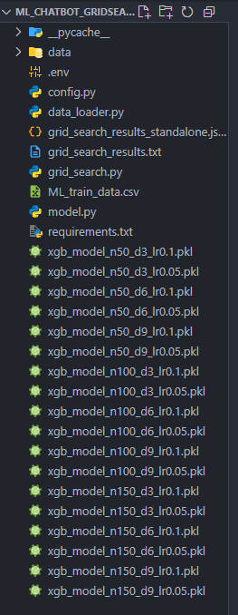

# Rapport Grid Search afin d'optimiser la vitesse de prédicition

Ce document présente les résultats du grid search réalisé sur les différents hyperparamètres dans le but d'optimiser la vitesse de réponse d'une requête Aliment --> Vin.
  Pour accélérer l'entraînement, [CUDA](https://developer.nvidia.com/cuda-toolkit) a été installé afin d'entrainer sur un GPU __NVIDIA RTX 4060__ et non un CPU.

---

## Paramètres Testés

Le Grid Search a été effectué sur les hyperparamètres suivants :

- **n_estimators** : 50, 100, 150  
- **max_depth** : 3, 6, 9  
- **learning_rate** : 0.1, 0.05

---

## Description du Processus

`grid_search.py` a permis de :

- **Charger et préparer les données**  
  Nous avons extrait les données nécessaire a l'entrainement des modèles au format CSV de notre DB afin de s'affranchir des requêtes SQL. Les données sont donc lues depuis `ML_train_data.csv`.
  
- **Entraîner et évaluer les modèles**  
  Les modèles sont entraînés à l'aide de `XGBClassifier (XGBoost) - Multiple Outputs` dans un cadre multi-sortie, avec sauvegarde des modèles dans des fichiers `.pkl` pour chaque combinaison d'hyperparamètres testée.

| Modèle                          | Type de tâche                | Format `y_train`              | Exemple                            |
|--------------------------------|------------------------------|-------------------------------|------------------------------------|
| `XGBClassifier`                | Classification simple        | 1D `(n_samples,)`             | Spam / Pas spam                    |
| `MultiOutputClassifier(XGB)`   | Multi-sortie (multi-label)   | 2D `(n_samples, n_labels)`    | Genres d’un film : Action, Drame   |
| `RandomForestClassifier`       | Simple ou multi-sortie       | 1D ou 2D                      | (Utilisé avant XGBoost, mais XGBoost est plus performant) |
  
- **Mesurer les performances**  
  Pour chaque configuration, le temps total d'entraînement et le temps de prédiction ont été mesuré. Toutes les métriques additionelles ont également été stockées dans `grid_search_result.json`. *precision_micro/macro | recall_micro/macro | f1_micro/macro | subset_accuracy | hamming_loss | jaccard_micro/macro*

---

## Extraits des Résultats du Grid Search

Exemples de résultats obtenus lors des tests :

- **Exemple 1**  
  **Hyperparamètres** : `{'n_estimators': 50, 'max_depth': 3, 'learning_rate': 0.1}`  
  **Temps de prédiction** : 45.5700s

- **Exemple 2**  
  **Hyperparamètres** : `{'n_estimators': 150, 'max_depth': 9, 'learning_rate': 0.1}`  
  **F1-macro (vin -> aliment)** : 0.4983

> **Note :** Les résultats indiquent que la configuration avec 50 estimateurs, une profondeur maximale de 3 et un taux d'apprentissage de 0.1 offre le meilleur temps de prédiction.
Alors que pour la performance (F1-macro), la configuration avec 150 estimateurs, une profondeur maximale de 9 et un taux d'apprentissage de 0.1 est la plus performante.

---

## Visualisation des Modèles Sauvegardés

L'image ci-dessous illustre l'ensemble des fichiers `.pkl` créés au fur et à mesure des entraînements :

---

## Résultats détaillés des tests

| Hyperparamètres                                   | Temps de prédiction (s) | F1_macro | F1_micro | Subset Accuracy | Jaccard_micro |
|---------------------------------------------------|-------------------------|----------|----------|-----------------|---------------|
| n_estimators=50, max_depth=3, learning_rate=0.1     | 45.57                   | 0.41224  | 0.83601  | 0.56311         | 0.71823       |
| n_estimators=50, max_depth=3, learning_rate=0.05     | 54.67                   | 0.36258  | 0.80786  | 0.50721         | 0.67765       |
| n_estimators=50, max_depth=6, learning_rate=0.1     | 53.90                   | 0.43739  | 0.85861  | 0.64020         | 0.75225       |
| n_estimators=50, max_depth=6, learning_rate=0.05     | 53.44                   | 0.40441  | 0.84833  | 0.59789         | 0.73661       |
| __n_estimators=50, max_depth=9, learning_rate=0.1__     | __53.80__                   | __0.46627__  | __0.86438__  | __0.66472__         | __0.76116__       |
| n_estimators=50, max_depth=9, learning_rate=0.05     | 47.85                   | 0.41496  | 0.85656  | 0.62492         | 0.74910       |
| n_estimators=100, max_depth=3, learning_rate=0.1    | 74.38                   | 0.42299  | 0.84788  | 0.60066         | 0.73592       |
| n_estimators=100, max_depth=3, learning_rate=0.05    | 86.87                   | 0.40847  | 0.83408  | 0.55762         | 0.71538       |
| n_estimators=100, max_depth=6, learning_rate=0.1    | 88.91                   | 0.46593  | 0.86456  | 0.65354         | 0.76144       |
| n_estimators=100, max_depth=6, learning_rate=0.05    | 85.39                   | 0.43725  | 0.85842  | 0.63943         | 0.75196       |
| n_estimators=100, max_depth=9, learning_rate=0.1    | 68.96                   | 0.49428  | 0.86888  | 0.68205         | 0.76816       |
| n_estimators=100, max_depth=9, learning_rate=0.05    | 89.43                   | 0.46510  | 0.86396  | 0.65005         | 0.76050       |
| n_estimators=150, max_depth=3, learning_rate=0.1    | 93.49                   | 0.43151  | 0.85425  | 0.61461         | 0.74558       |
| n_estimators=150, max_depth=3, learning_rate=0.05    | 120.55                  | 0.41728  | 0.84317  | 0.57917         | 0.72887       |
| n_estimators=150, max_depth=6, learning_rate=0.1    | 113.64                  | 0.47140  | 0.86818  | 0.67626         | 0.76706       |
| n_estimators=150, max_depth=6, learning_rate=0.05    | 114.75                  | 0.46300  | 0.86172  | 0.64677         | 0.75704       |
| n_estimators=150, max_depth=9, learning_rate=0.1    | 116.75                  | 0.49826  | 0.87120  | 0.69129         | 0.77179       |
| n_estimators=150, max_depth=9, learning_rate=0.05    | 121.06                  | 0.46982  | 0.86743  | 0.67780         | 0.76590       |

---

## Une alternative ?

| Méthode | Description | Avantages | Inconvénients |
|---------|------------|-----------|--------------|
| **Grid Search** | Méthode exhaustive évaluant toutes les combinaisons d'hyperparamètres | __Simplicité :__ facile à mettre en œuvre  __Exhaustivité :__ vision complète de l'impact des hyperparamètres | - Coût en temps et ressources élevé  - Scalabilité limitée pour les espaces complexes |
| **Optuna** | Optimisation bayésienne intelligente de l'espace des hyperparamètres | __Efficacité :__ recherche ciblée  __Flexibilité :__ gestion d'espaces continus et discrets | - Complexité de configuration  - Reproductibilité variable |

---